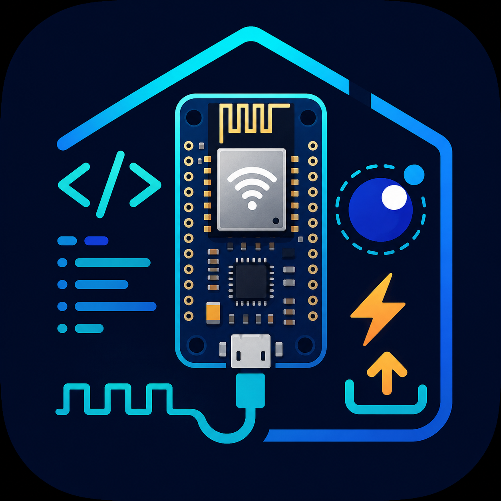

# NodeMCU Lua for VS Code

<p align="center">
  
</p>

A VS Code extension for end-to-end Lua development on NodeMCU / ESP8266 boards.
It initializes projects, manages a known-good NodeMCU firmware checkout, builds
and flashes firmware, syncs Lua files to the device, opens a serial monitor, and
adds IntelliSense stubs for NodeMCU globals.

The extension is designed so you do not need to clone `nodemcu-firmware`
manually. On first use it downloads and patches the managed firmware in VS Code
extension storage. You only need a custom firmware checkout if you deliberately
configure one.

## UI Preview

The marketplace logo is packaged from:

<p>
  
</p>

The Activity Bar icon is packaged from:

<p>
  
</p>

In VS Code, open the NodeMCU Activity Bar item to access Device Explorer, Lua
Modules, and C Modules. When a folder is not initialized yet, the NodeMCU view
shows an **Initialize NodeMCU Project** action.

## Quick Start

1. Install the extension in VS Code.
2. Open the folder that will contain your NodeMCU project.
3. Open the NodeMCU Activity Bar item.
4. Click **Initialize NodeMCU Project**.
5. Connect your NodeMCU / ESP8266 board with a USB data cable.
6. Follow progress in the **NodeMCU** output channel.
7. Edit Lua files in `src/` and save them.
8. Press `F5` to upload changes and open the serial monitor.

The first setup can take a while because the extension downloads tools and
firmware, builds the selected firmware image, flashes the board, and performs
the first device filesystem sync.

After the first successful setup, normal development is faster. Saving a file in
`src/` uploads only that changed file, and deleting a file from `src/` removes
the matching file from the device.

## What Gets Created

Running **NodeMCU: Initialize Project** creates a project like this:

```text
your-project/
|- nodemcu.ini
`- src/
   `- init.lua
```

Put your Lua application files in `src/`. The extension watches this directory
and syncs it to the device.

## First Run vs Later Runs

| Action | First run | Later runs |
| --- | --- | --- |
| Project setup | Creates `nodemcu.ini` and `src/init.lua` | Reuses existing project files |
| Firmware source | Downloads managed firmware | Reuses cached firmware |
| Firmware build | Builds selected C modules | Rebuilds only when C modules change |
| Flashing | Flashes the ESP8266 | Needed only after firmware changes |
| File sync | Formats and mirrors `src/` to the device | Uploads changed files and mirrors deletions |
| Serial monitor | Opens after upload with `F5` | Closes and reopens around uploads |

## Core Workflow

1. Edit a Lua file in `src/`.
2. Save the file.
3. The **NodeMCU** output channel opens and logs the upload.
4. The first sync mirrors the whole `src/` directory.
5. Later saves upload only the saved file.
6. Press `F5` for **Upload and Monitor**.

`F5` closes any existing NodeMCU serial monitor, uploads pending changes, syncs
enabled Lua modules, then opens a fresh `python -m serial.tools.miniterm`
terminal for the selected port.

## Sidebar Views

### Device Explorer

Shows detected serial ports. Click a port to select it. When detection is
unambiguous, the extension can select the port automatically and write it to
`nodemcu.ini`.

The extension keeps a configured port when it is still available. If the
configured port disappears, it only auto-selects a replacement when exactly one
serial port is present or exactly one NodeMCU-like port is detected.

### Lua Modules

Lists Lua helper modules from the managed firmware library. Checking a module
adds it to `[lua_modules]` in `nodemcu.ini`; unchecking it removes the module
from the device on the next sync.

Lua module autocomplete also participates in this workflow. Accepting a module
completion inserts `name = require("name")`, enables the module in
`nodemcu.ini`, refreshes the sidebar, and syncs the module to the device.

### C Modules

Lists firmware C modules from `app/modules` plus supported optional/library
modules. Checking a module enables it in `[c_modules]`. Changing C modules can
require a firmware rebuild and flash because C modules are compiled into the
firmware image.

The `file` module is mandatory for file upload support and cannot be disabled.

## Commands

Open the Command Palette and run commands under the **NodeMCU** category.

| Command | Keybinding | Use |
| --- | --- | --- |
| `NodeMCU: Initialize Project` | | Create `nodemcu.ini`, `src/`, and starter Lua files. |
| `NodeMCU: Build Firmware` | `Ctrl+Shift+B` | Build the selected firmware image. |
| `NodeMCU: Flash Firmware` | | Flash the most recent firmware build to the ESP8266. |
| `NodeMCU: Build & Flash` | `Ctrl+Alt+B` | Build firmware, then flash it. |
| `NodeMCU: Upload File to Device` | | Upload the current file when it is inside `src/`. |
| `NodeMCU: Upload Changes to Device` | | Sync local `src/` changes to the device. |
| `NodeMCU: Upload and Monitor` | `F5` | Upload changes, sync Lua modules, and open the serial monitor. |
| `NodeMCU: Run File on Device` | | Execute a remote Lua file on the board. |
| `NodeMCU: Reset Device` | | Reset the connected board. |
| `NodeMCU: Refresh Device Explorer` | | Refresh detected ports and device data. |
| `NodeMCU: Sync Lua Modules to Device` | | Compile and upload enabled Lua modules. |
| `NodeMCU: Add Lua Module from Library` | | Pick a firmware Lua module and enable it. |
| `NodeMCU: Toggle C Module` | | Enable or disable a firmware C module. |
| `NodeMCU: Regenerate Lua API Stubs` | | Recreate `.vscode/nodemcu-api.lua` and `.luarc.json`. |
| `NodeMCU: Open nodemcu.ini` | | Open the project configuration file. |
| `NodeMCU: Open Serial Monitor` | | Open a serial monitor for the selected port. |
| `NodeMCU: Select Port` | | Choose the serial port manually. |
| `NodeMCU: Cancel Queued Commands` | | Cancel pending extension operations. |

## Configuration

Most users can leave `nodemcu.ini` alone after initialization. The extension
updates the selected port, enabled modules, device UUIDs, and sync timestamp as
needed.

Example:

```ini
[nodemcu]
lua_version = 53
lua_number_integral = false
lua_number_64bits = false
port =
baud = 460800
upload_baud = 460800
src = src
flash_mode = dio
flash_freq = 80m
flash_size = 4M

[c_modules]
adc = true
file = true
gpio = true
net = true
node = true
tmr = true
uart = true
wifi = true
; mqtt = false
; sjson = false
; u8g2 = false

[devices]
uuids =

[lua_modules]
; bh1750 = lua/bh1750.lua
; gossip = https://github.com/nodemcu/nodemcu-firmware/raw/master/lua_modules/gossip/gossip.lua

[flash]
; extra_files = spiffs.bin@0x100000

[build]
parallel = true
verbose = false
```

Important settings:

| Setting | Meaning |
| --- | --- |
| `nodemcu.src` | Local directory that is mirrored to the device. Defaults to `src`. |
| `nodemcu.port` | Serial port such as `COM3` or `/dev/ttyUSB0`. Usually auto-detected. |
| `nodemcu.baud` | Runtime serial baud rate. |
| `nodemcu.upload_baud` | Upload baud rate. |
| `nodemcu.flash_mode` | ESP8266 flash mode: `dio`, `qio`, `dout`, or `qout`. |
| `nodemcu.flash_freq` | Flash frequency: `20m`, `26m`, `40m`, or `80m`. |
| `nodemcu.flash_size` | Flash size such as `1M`, `4M`, or `detect`. |
| `[c_modules]` | Firmware modules compiled into the image. |
| `[lua_modules]` | Lua library modules synced to the device as compiled `.lc` files. |
| `[devices] uuids` | Approved device IDs for the workspace. |
| `[sync] last_timestamp` | Internal timestamp used for incremental sync. |

VS Code settings:

| Setting | Default | Meaning |
| --- | --- | --- |
| `nodemcu-vscode.src` | `src` | Overrides the watched upload directory. |
| `nodemcu-vscode.port` | empty | Overrides the port in `nodemcu.ini`. |
| `nodemcu-vscode.pythonPath` | `python` | Python executable for tools. |
| `nodemcu-vscode.cmakePath` | `cmake` | CMake executable for firmware builds. |
| `nodemcu-vscode.autoInstallNodemcuTool` | `true` | Install `nodemcu-tool` with pip when missing. |
| `nodemcu-vscode.outputVerbose` | `false` | Show more build and flash output. |

## Managed Firmware

By default, the extension uses managed firmware in VS Code global storage. This
keeps normal projects small and avoids requiring every user to clone
`nodemcu-firmware`.

Use a custom firmware checkout only when you need to patch firmware sources or
build against a different tree. In that case, set `firmware_path` in
`nodemcu.ini` to the checkout path.

## Lua IntelliSense and Snippets

The extension can generate:

```text
.vscode/nodemcu-api.lua
.luarc.json
```

These files let the Lua language server understand common NodeMCU globals. Run
**NodeMCU: Regenerate Lua API Stubs** if they need to be recreated.

Snippet prefixes:

| Prefix | Snippet |
| --- | --- |
| `ninit` | Startup diagnostics. |
| `nwifi` | WiFi station setup. |
| `nmqtt` | MQTT client setup. |
| `nhttp` | Minimal HTTP server. |
| `ntmr` | Repeating timer. |

## Device Safety

The first sync for a new device/workspace can format the device filesystem so
the local `src/` directory becomes the source of truth. When the workspace has
known device UUIDs and a different device is attached, VS Code asks before
adding that device and syncing.

Keep one workspace per physical project when possible. That makes the device
UUID guard useful and reduces accidental cross-project uploads.

## Requirements

- VS Code 1.85 or newer.
- Node.js 20 or newer for extension development.
- A NodeMCU / ESP8266 board.
- A USB data cable that supports data, not just charging.
- Python available as `python`, unless configured otherwise.
- CMake and a supported generator such as Ninja or Make for firmware builds.

The extension can install `nodemcu-tool` automatically when needed.

## Troubleshooting

### The first initialization is slow

This is expected. The first run may download managed tools, download firmware,
build firmware, flash the board, format the device filesystem, and sync `src/`.

### No serial port is detected

Check the USB cable, driver, and board power. Then run:

```text
NodeMCU: Select Port
```

On Windows, common USB serial adapters may require CP210x or CH340 drivers.

### Uploads do not appear on the device

Confirm the file is inside the configured `src/` directory. Then open the
**NodeMCU** output channel and check the latest upload log.

### C module changes are not visible on the board

C modules are compiled into firmware. Run:

```text
NodeMCU: Build & Flash
```

Then upload the Lua files again.

### Lua module `require()` fails

Make sure the module is checked in the **Lua Modules** sidebar or listed in
`[lua_modules]`. Then run **NodeMCU: Sync Lua Modules to Device** or press `F5`.

### The wrong project is syncing to the board

Open `nodemcu.ini` and check `[devices] uuids`. If the attached device belongs
to another workspace, open that workspace before syncing.

## Extension Development

Install dependencies and build:

```bash
npm install
npm run typecheck
npm run build
```

Run tests:

```bash
npm test
```

Package a VSIX:

```bash
npm run package
```

The extension host loads `dist/extension.js`, so rebuild after source changes.
See `AGENTS.md` for internal architecture, testing notes, and handoff context.

## License

MIT
