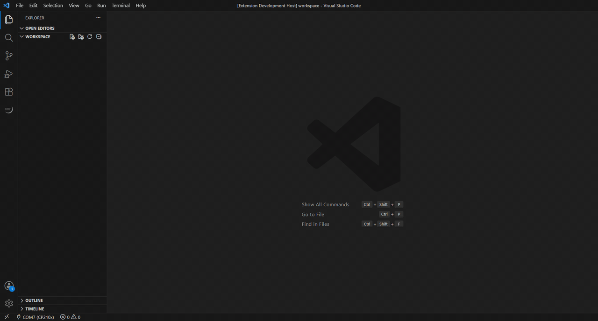
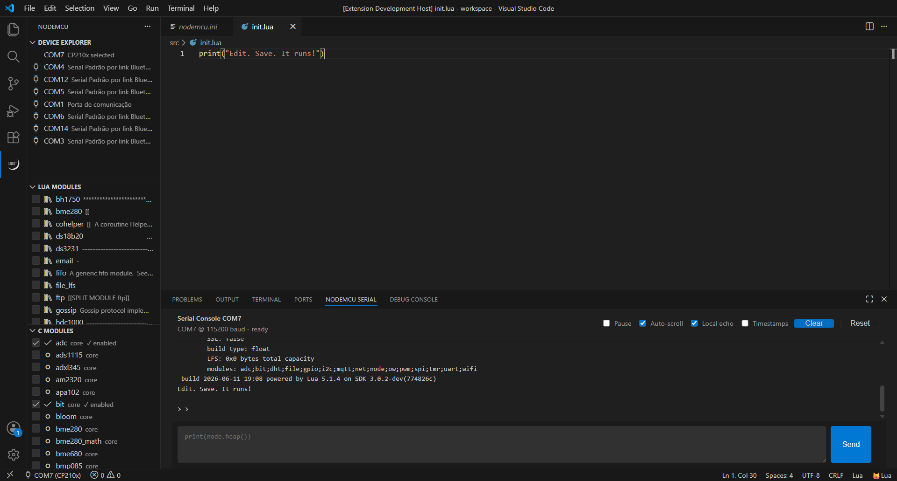
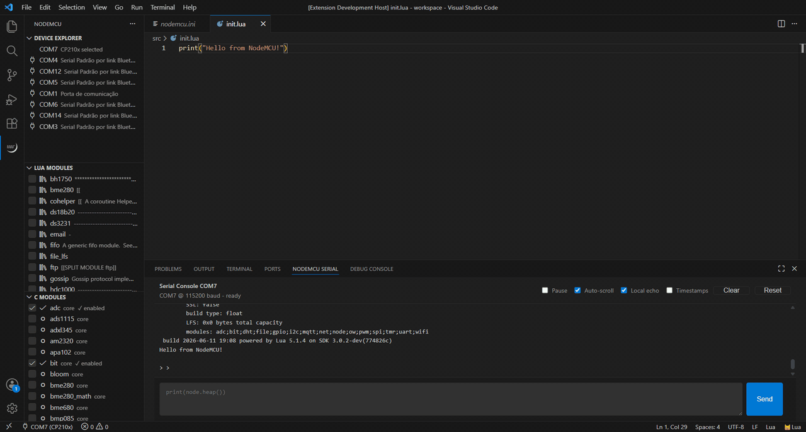
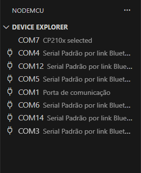
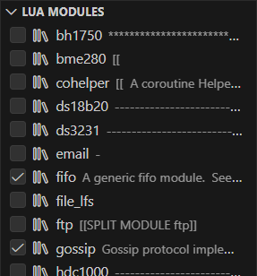
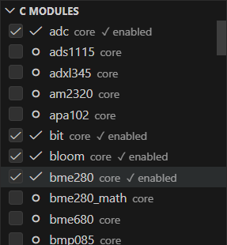
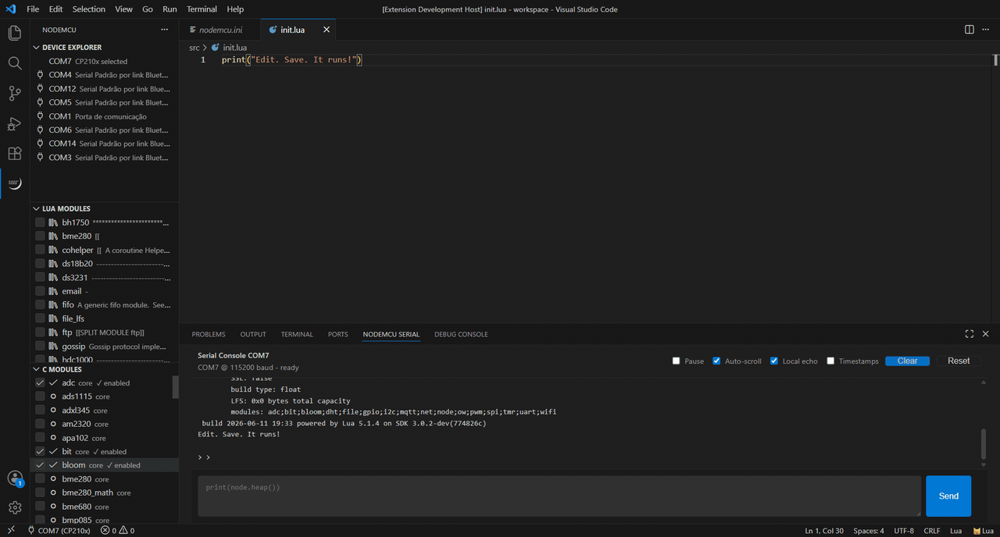
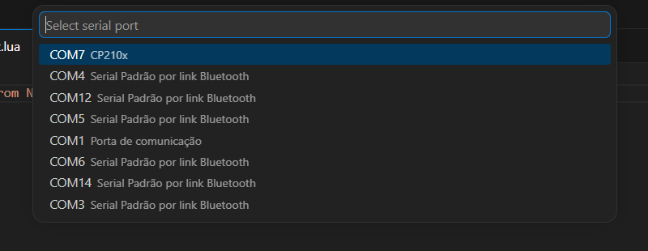
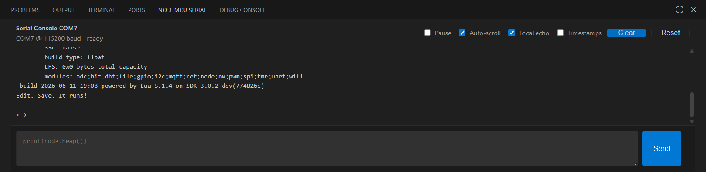

<h1>NodeMCU Lua for VS Code</h1>

<p align="center">
  
</p>

<p align="center">
  
</p>

**Build • Flash • Sync • Monitor** — everything you need for Lua development on
NodeMCU / ESP8266 boards, in one VS Code extension.

First-time setup is fully automatic. The extension downloads the ESP8266
toolchain, the NodeMCU firmware source, and the required Python tools, builds
the firmware, flashes the board, and creates your project. After that,
development is as simple as editing files in `src/` and pressing Save.

## Features

- ✅ **One-click project initialization** — a single **Initialize NodeMCU Project** action
- ✅ **Automatic firmware build and flash** — toolchain and firmware are downloaded and managed for you.
- ✅ **Auto-upload on save** — save a file in `src/` and it runs on the board
- ✅ **Live Serial Console** — always in view in the bottom panel
- ✅ **NodeMCU Lua IntelliSense** — completion and hover docs for the device API
- ✅ **Config-aware warnings & quick-fixes** — using a C/Lua module or a `u8g2`/`ucg` font that isn't enabled in `nodemcu.ini` gets a warning with a one-click fix that enables it; `u8g2.font_*` / `ucg.font_*` autocomplete enables the picked font on accept.
- ✅ **Lua and C module management** — pick modules with checkboxes in the sidebar and automatically update the firmware and flash it to the board.
- ✅ **Serial port explorer** — seamless device switching, it warns if try to sync a different device from the one initially set.
- ✅ **No ESPlorer, no `nodemcu-tool` setup, no firmware checkout required**

Getting started with NodeMCU Lua used to mean assembling a toolbox by hand:
clone `nodemcu-firmware`, set up a cross-compiler, edit C headers to select
modules, flash with `esptool`, then switch to ESPlorer or `nodemcu-tool` to
upload Lua files and watch serial output. This extension collapses all of that
into one click.

## How it works

```text
                 VS Code
                    │
                    ▼
           NodeMCU Extension
                    │
     ┌──────────────┼──────────────┐
     ▼              ▼              ▼
Build Firmware  Upload Lua    Serial Console
Flash Device    on Save       (live monitor)
     └──────────────┴──────────────┘
                    │
                    ▼
            ESP8266 / NodeMCU
```

The firmware source, cross-compiler, and flashing tools live in VS Code
extension storage — your project folder stays small (`nodemcu.ini` + `src/`).

## Quick Start


1. Install the extension in VS Code.
2. Open the folder that will contain your NodeMCU project.
3. Open the NodeMCU Activity Bar item.
4. Click **Initialize NodeMCU Project**.
5. Connect your NodeMCU / ESP8266 board with a USB data cable.
6. Watch the bottom-panel **NodeMCU Serial** console.
7. Edit Lua files in `src/` and save them.
8. Press `F5` to upload pending changes; the Serial Console stays connected.

That's the whole setup — the only host prerequisites are Python 3 and CMake
(see [Requirements](#requirements)). The first run takes a while because the
extension downloads tools and firmware, builds the firmware image, flashes the
board, and performs the first device filesystem sync. After that, saving a file
in `src/` uploads only that file.



## What Gets Created

Running **NodeMCU: Initialize Project** creates a project like this:

```text
your-project/
|- nodemcu.ini
`- src/
   `- init.lua
```

Put your Lua application files in `src/`. The extension watches this directory
and syncs it to the device.

## Core Workflow

```text
Initialize
    ↓
Write Lua in src/
    ↓
Save
    ↓
Auto Upload
    ↓
See output in Serial Console
```



1. Edit a Lua file in `src/`.
2. Save the file.
3. The bottom-panel **NodeMCU Serial** console remains focused and shows device output.
4. The first sync mirrors the whole `src/` directory.
5. Later saves upload only the saved file.
6. Press `F5` for **Upload and Monitor** when you want to upload pending changes explicitly.

The extension owns the selected serial port through a shared serial session.
Commands such as upload, delete, run, reset, and Lua module sync write through
that session while the Serial Console keeps reading. During those operations the
console input box is disabled, but serial output continues to stream.

Use **NodeMCU: Release Serial Port** or **NodeMCU: Disconnect Serial Session** if
you want another tool to use the port. **NodeMCU: Open Serial Console** shows the
console and reconnects it.

## First Run vs Later Runs

| Action | First run | Later runs |
| --- | --- | --- |
| Project setup | Creates `nodemcu.ini` and `src/init.lua` | Reuses existing project files |
| Firmware source | Downloads managed firmware | Reuses cached firmware |
| Firmware build | Builds selected C modules | Rebuilds only when C modules change |
| Flashing | Flashes the ESP8266 | Needed only after firmware changes |
| File sync | Formats and mirrors `src/` to the device | Uploads changed files and mirrors deletions |
| Serial Console | Opens and connects automatically | Stays open while commands run |

## Sidebar Views

### Device Explorer



Shows detected serial ports. Click a port to select it. When detection is
unambiguous, the extension can select the port automatically and write it to
`nodemcu.ini`.

The extension keeps a configured port when it is still available. If the
configured port disappears, it only auto-selects a replacement when exactly one
serial port is present or exactly one NodeMCU-like port is detected.

### Lua Modules



Lists Lua helper modules from the managed firmware library. Checking a module
adds it to `[lua_modules]` in `nodemcu.ini`; unchecking it removes the module
from the device on the next sync.

Lua module autocomplete also participates in this workflow. Accepting a module
completion inserts `name = require("name")`, enables the module in
`nodemcu.ini`, refreshes the sidebar, and syncs the module to the device.

### C Modules



Lists firmware C modules from `app/modules` plus supported optional/library
modules. Checking a module enables it in `[c_modules]`. Changing C modules can
require a firmware rebuild and flash because C modules are compiled into the
firmware image.

The `file` module is mandatory for file upload support and cannot be disabled.

## Building and Flashing Firmware



Press `Ctrl+Alt+B` (**NodeMCU: Build & Flash**) after changing C modules. The
extension builds the firmware image with the managed toolchain, flashes it, and
reconnects the Serial Console as the board reboots. Rebuilds happen only when
the selected C modules change.

## Commands

Open the Command Palette and run commands under the **NodeMCU** category. You usually won't need to use it, except for **NodeMCU: Initialize Project**.

| Command | Keybinding | Use |
| --- | --- | --- |
| `NodeMCU: Initialize Project` | | Create `nodemcu.ini`, `src/`, and starter Lua files. |
| `NodeMCU: Build Firmware` | `Ctrl+Shift+B` | Build the selected firmware image. |
| `NodeMCU: Flash Firmware` | | Flash the most recent firmware build to the ESP8266. |
| `NodeMCU: Build & Flash` | `Ctrl+Alt+B` | Build firmware, then flash it. |
| `NodeMCU: Upload File to Device` | | Upload the current file when it is inside `src/`. |
| `NodeMCU: Upload Changes to Device` | | Sync local `src/` changes to the device. |
| `NodeMCU: Upload and Monitor` | `F5` | Upload changes and keep the Serial Console focused. |
| `NodeMCU: Run File on Device` | | Execute a remote Lua file on the board. |
| `NodeMCU: Reset Device` | | Reset the connected board. |
| `NodeMCU: Refresh Device Explorer` | | Refresh detected ports and device data. |
| `NodeMCU: Sync Lua Modules to Device` | | Compile and upload enabled Lua modules. |
| `NodeMCU: Add Lua Module from Library` | | Pick a firmware Lua module and enable it. |
| `NodeMCU: Toggle C Module` | | Enable or disable a firmware C module. |
| `NodeMCU: Regenerate Lua API Stubs` | | Recreate `.vscode/nodemcu-api.lua` and `.luarc.json`. |
| `NodeMCU: Open nodemcu.ini` | | Open the project configuration file. |
| `NodeMCU: Open Serial Console` | | Show and connect the shared Serial Console. |
| `NodeMCU: Disconnect Serial Session` | | Stop the shared serial session until you reconnect. |
| `NodeMCU: Release Serial Port` | | Release the selected port for another tool. |
| `NodeMCU: Reconnect Serial Port` | | Re-enable automatic serial ownership and reconnect. |
| `NodeMCU: Select Port` | | Choose the serial port manually. |
| `NodeMCU: Cancel Queued Commands` | | Cancel pending extension operations. |

## Configuration

Most users can leave `nodemcu.ini` alone after initialization. The extension
updates the selected port, enabled modules, device UUIDs, and sync timestamp as
needed.

Example:

```ini
[nodemcu]
lua_version = 51
lua_number_integral = false
lua_number_64bits = false
port =
baud = 460800
upload_baud = 460800
src = src
flash_mode = dio
flash_freq = 80m
flash_size = 4M

[c_modules]
adc = true
file = true
gpio = true
net = true
node = true
tmr = true
uart = true
wifi = true
; mqtt = false
; sjson = false
; u8g2 = false

[devices]
uuids =

[lua_modules]
; bh1750 = lua/bh1750.lua
; gossip = https://github.com/nodemcu/nodemcu-firmware/raw/master/lua_modules/gossip/gossip.lua

[flash]
; extra_files = spiffs.bin@0x100000

[build]
parallel = true
verbose = false
```

Important settings:

| Setting | Meaning |
| --- | --- |
| `nodemcu.src` | Local directory that is mirrored to the device. Defaults to `src`. |
| `nodemcu.port` | Serial port such as `COM3` or `/dev/ttyUSB0`. Usually auto-detected. |
| `nodemcu.baud` | Runtime serial baud rate. |
| `nodemcu.upload_baud` | Upload baud rate. |
| `nodemcu.flash_mode` | ESP8266 flash mode: `dio`, `qio`, `dout`, or `qout`. |
| `nodemcu.flash_freq` | Flash frequency: `20m`, `26m`, `40m`, or `80m`. |
| `nodemcu.flash_size` | Flash size such as `1M`, `4M`, or `detect`. |
| `[c_modules]` | Firmware modules compiled into the image. |
| `[lua_modules]` | Lua library modules synced to the device as compiled `.lc` files. |
| `[u8g2_fonts]` / `[ucg_fonts]` | Fonts compiled into the image (bare `font_*` names). Empty/omitted keeps the firmware default; the "Compile font" quick-fix and font autocomplete populate these. |
| `[u8g2_displays]` / `[ucg_displays]` | Display drivers compiled into the image (by binding name). |
| `[devices] uuids` | Approved device IDs for the workspace. |
| `[sync] last_timestamp` | Internal timestamp used for incremental sync. |

VS Code settings:

| Setting | Default | Meaning |
| --- | --- | --- |
| `nodemcu-vscode.src` | `src` | Overrides the watched upload directory. |
| `nodemcu-vscode.port` | empty | Overrides the port in `nodemcu.ini`. |
| `nodemcu-vscode.pythonPath` | `python` | Python executable for tools. |
| `nodemcu-vscode.cmakePath` | `cmake` | CMake executable for firmware builds. |
| `nodemcu-vscode.autoInstallNodemcuTool` | `true` | Install `nodemcu-tool` with pip when missing. |
| `nodemcu-vscode.outputVerbose` | `false` | Show more build and flash output. |

## Managed Firmware

By default, the extension uses managed firmware in VS Code global storage. This
keeps normal projects small and avoids requiring every user to clone
`nodemcu-firmware`.

Use a custom firmware checkout only when you need to patch firmware sources or
build against a different tree. In that case, set `firmware_path` in
`nodemcu.ini` to the checkout path.

## Lua IntelliSense and Snippets


Typing a firmware Lua module name (such as `fifo`) offers a **NodeMCU Lua
module** completion. Accepting it inserts `fifo = require("fifo")`, enables the
module in `nodemcu.ini`, checks it in the sidebar, and syncs it to the device.
Hover documentation comes from the Lua language server.

The extension can generate:

```text
.vscode/nodemcu-api.lua
.luarc.json
```

These files let the Lua language server understand common NodeMCU globals. Run
**NodeMCU: Regenerate Lua API Stubs** if they need to be recreated.

Snippet prefixes:

| Prefix | Snippet |
| --- | --- |
| `ninit` | Startup diagnostics. |
| `nwifi` | WiFi station setup. |
| `nmqtt` | MQTT client setup. |
| `nhttp` | Minimal HTTP server. |
| `ntmr` | Repeating timer. |

## Device Safety

The first sync for a new device/workspace can format the device filesystem so
the local `src/` directory becomes the source of truth. When the workspace has
known device UUIDs and a different device is attached, VS Code asks before
adding that device and syncing.

Keep one workspace per physical project when possible. That makes the device
UUID guard useful and reduces accidental cross-project uploads.

## Requirements

- VS Code 1.85 or newer.
- A NodeMCU / ESP8266 board.
- A USB data cable that supports data, not just charging.
- Python 3 available as `python`, unless configured otherwise.
- CMake and a supported generator such as Ninja or Make for firmware builds.

You do **not** need a `nodemcu-firmware` checkout, an ESP8266 cross-compiler,
or standalone esptool/ESPlorer installs — the extension manages those itself.

## Troubleshooting

### The first initialization is slow

This is expected. The first run may download managed tools, download firmware,
build firmware, flash the board, format the device filesystem, and sync `src/`.

### No serial port is detected

Check the USB cable, driver, and board power. Then run:

```text
NodeMCU: Select Port
```



On Windows, common USB serial adapters may require CP210x or CH340 drivers.

### Uploads do not appear on the device

Confirm the file is inside the configured `src/` directory. Then check the
bottom-panel **NodeMCU Serial** console for device output. The **NodeMCU** output
channel still stores extension logs, but it does not open automatically.



### C module changes are not visible on the board

C modules are compiled into firmware. Run:

```text
NodeMCU: Build & Flash
```

Then upload the Lua files again.

### Lua module `require()` fails

Make sure the module is checked in the **Lua Modules** sidebar or listed in
`[lua_modules]`. Then run **NodeMCU: Sync Lua Modules to Device** or press `F5`.

### The wrong project is syncing to the board

Open `nodemcu.ini` and check `[devices] uuids`. If the attached device belongs
to another workspace, open that workspace before syncing.

## Extension Development

Install dependencies and build:

```bash
npm install
npm run typecheck
npm run build
```

Run tests:

```bash
npm test
```

Package a VSIX:

```bash
npm run package
```

The extension host loads `dist/extension.js`, so rebuild after source changes.
See `AGENTS.md` for internal architecture, testing notes, and handoff context.

## License

MIT
